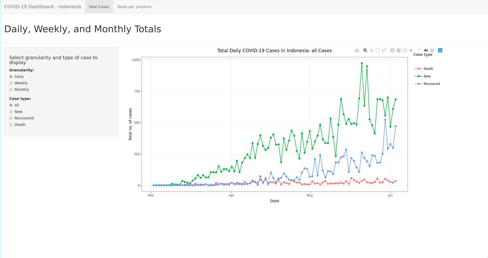
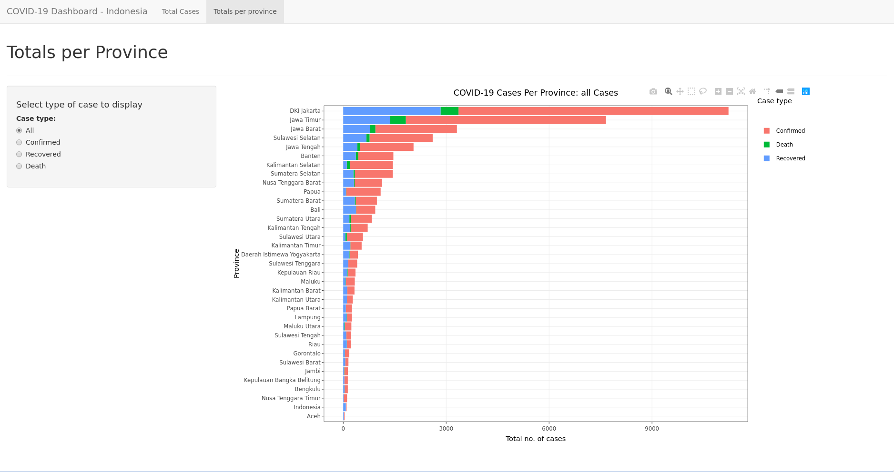

COVID-19 Dashboard
========================================================
author: Fahmi Adi Nugraha
date: 06/07/2020
autosize: true

Overview
========================================================

Our product allows the user to keep track of the number of COVID-19 cases
throughout Indonesia. It contains two charts:

- A line graph detailing the total number of cases at different granularities
- A histogram showing the total number of cases at in a number of provinces

Each chart displays three types of cases:

- Confirmed cases
- Recoveries
- Deaths

Data
========================================================

|Province_name             | Confirmed_cases| Recovered_cases| Death_cases|
|:-------------------------|---------------:|---------------:|-----------:|
|Aceh                      |              20|              18|           1|
|Sumatera Utara            |             605|             179|          46|
|Sumatera Barat            |             618|             336|          27|
|Riau                      |             118|             101|           6|
|Jambi                     |             103|              27|           6|
|Sumatera Selatan          |            1104|             297|          42|
|Bengkulu                  |              92|              37|           4|
|Kepulauan Bangka Belitung |              98|              34|           1|
|Lampung                   |             143|              98|          11|
|Kepulauan Riau            |             227|             115|          15|

The data is taken from the Humanitarian Data Exchange and can be found
[here.][1] Displayed above are the first five rows of the total number of cases
per province.

[1]: https://data.humdata.org/dataset/indonesia-covid-19-cases-recoveries-and-deaths-per-province

Usage - Daily, Weekly and Monthly Totals
========================================================

Usage - Totals per Province
========================================================

